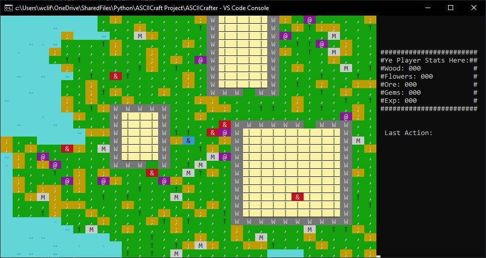

.. role:: flower
   :class: flower
.. role:: tree
   :class: tree
.. role:: mountain
   :class: mountain
.. role:: special
   :class: special
.. role:: wall
   :class: wall
.. role:: enemy
   :class: enemy

Welcome to ASCIICrafter's documentation!
========================================

   ASCIICrafter Screenshot

A game inspired by Minecraft, but with ASCII graphics. The game is written in Python 3.8.15 and uses the 
`curses library <https://docs.python.org/3/howto/curses.html>`_ 
for the graphics. The game is still in development, but it is playable.

| In the current version, you can move around, harvest blocks, place blocks, and attack enemies. Enemies don't attack right now and they feature random movement. Worlds are randomly generated, but they are not infinite. The resources and buildings are randomly generated as well.

The modifiable blocks are:
   * :flower:`; - Flowers`
   * :tree:`T - Trees`
   * :mountain:`M - Mountains`
   * :special:`@ - Special`
   * :enemy:`& - Enemy`
   * :wall:`W - Wall`

The controls are as follows:
   * :kbd:`w`, :kbd:`a`, :kbd:`s`, :kbd:`d` - move the player
   * :kbd:`up`, :kbd:`down`, :kbd:`left`, :kbd:`right` - attack or deconstruct in the direction
   * :kbd:`space` - harvest the block you are standing on
   * :kbd:`p` - pauses the background music
   * :kbd:`esc` - exits the game

Enemies
=======
These are the enemies that are currently implemented in the game.

Ogre
----
A large enemy that is slow and does a lot of damage. Atk: 5, Def: 2, HP: 10
Loot: 1-3 wood, 1-2 stone, 1-2 iron, 1-2 gold, 1-2 diamond, 1-2 special

Goblin
------
A small enemy that is fast and does little damage. Atk: 1, Def: 1, HP: 5
Loot: 1-2 wood, 1-2 stone, 1-2 iron, 1-2 gold, 1-2 diamond, 1-2 special

Items
=====
These are the items that are currently implemented in the game.

Wood
----
A basic resource that is used to craft other items. It can be harvested from trees.

Stone
-----
A basic resource that is used to craft other items. It can be harvested from mountains.

Iron
----
A basic resource that is used to craft other items. It can be harvested from mountains.

Blocks
======
These are the blocks that are currently implemented in the game.

Flower
------
A decorative block that can be placed anywhere.

Tree
----
A decorative block that can be placed anywhere.

Mountain
--------
A decorative block that can be placed anywhere.

Special
-------
A decorative block that can be placed anywhere.

Wall
----

A decorative block that can be placed anywhere.

Research
========
These are the researches that are currently implemented in the game.

Smithing
--------
Allows you to craft iron swords.

Fletching
---------
Allows you to craft wooden swords.

Mining
------
Allows you to harvest stone.

Gear and Weapons
================
These are the gear and weapons that are currently implemented in the game.

Wooden Sword
------------
A basic weapon that can be crafted from wood. It can be used to attack enemies.

Stone Sword
-----------
A basic weapon that can be crafted from stone. It can be used to attack enemies.

Iron Sword
----------
A basic weapon that can be crafted from iron. It can be used to attack enemies.

Classes and Functions
=====================

.. toctree::

   Code

   
Indices and tables
==================

* :ref:`genindex`
* :ref:`modindex`
* :ref:`search`
